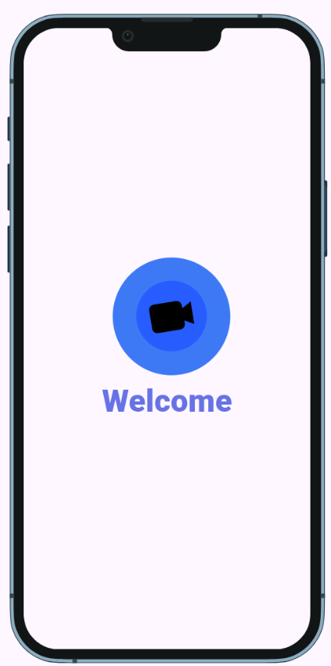
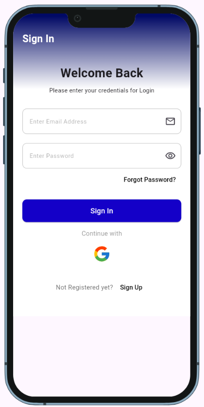
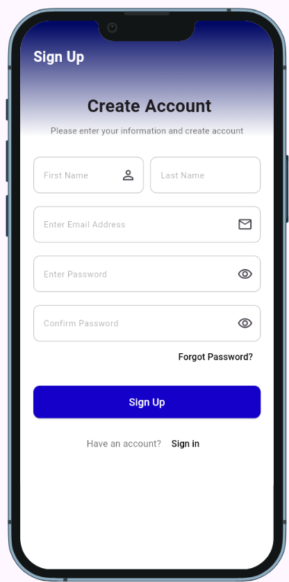
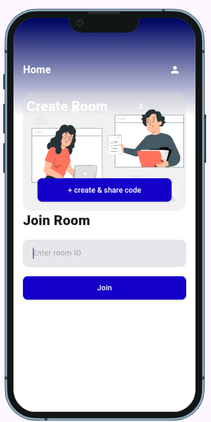
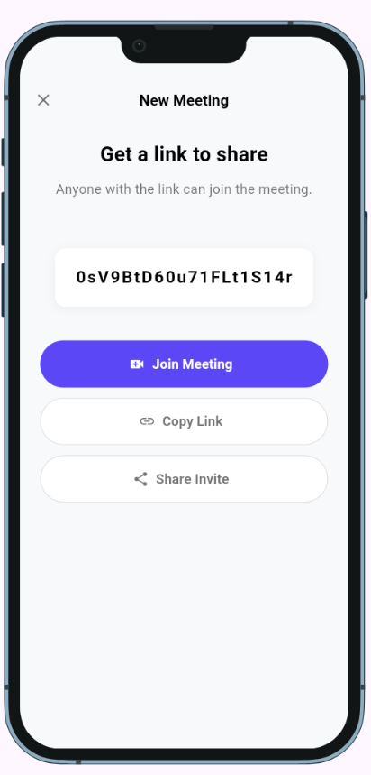
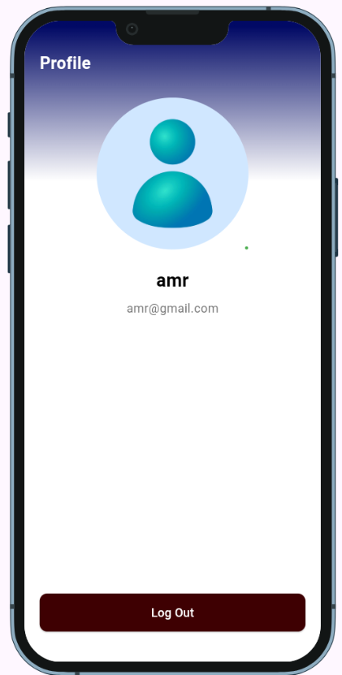
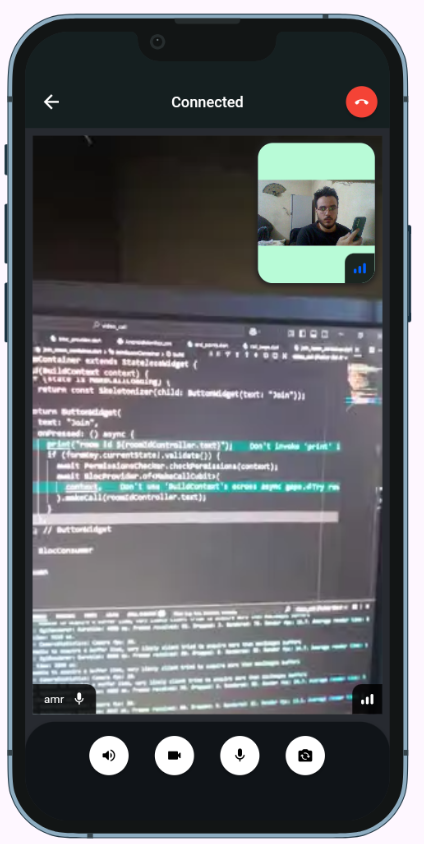
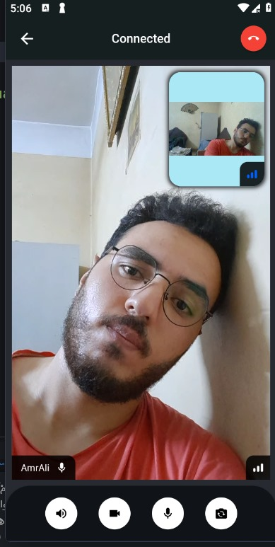

# 📞 Flutter Video Call App

A modern video calling application built with Flutter, using Stream Video SDK for real-time communication and Firebase Authentication for secure login.
The app allows users to register, sign in (with Email/Password or Google), reset forgotten passwords, create or join meeting rooms, and share room links.

## 🚀 Features

### 🔐 Authentication System

   - Firebase Email/Password sign-up & login.

   - Google Sign-In integration.

   - Forgot Password (email reset).

### 📡 Video Calls (Powered by Stream SDK)

   - Create new meeting rooms.

   - Join existing rooms using Call ID.

   - Share room link for invitations.

   - Multiple participants support.

   - Real-time audio & video streaming.

   - Automatic handling of join/leave events.

### 🎨 User Experience

   - Responsive design (Android & iOS).

   - Lottie animations.

   - Dark-themed meeting UI.

### 👤 User Management

   - Profile page with user info & avatar.

   - Secure session handling with Firebase.
---

## 📸 Screenshots
###  App Register

  <table>
    <tr>
      <td align="center">
        
         <b>splash screen</b>
      </td>    
      <td align="center">
        
         <b>SignIn</b>
      </td>
      <td align="center">
        
         <b>Sign Up</b>
      </td>
    </tr>   
  </table>

###  App Features   

  <table>
    <tr>
      <td align="center">
        
         <b>Home Screen</b>
      </td>
      <td align="center">
        
         <b>generate room</b>
      </td>
      <td align="center">
        
         <b>profile</b>
      </td>     
    </tr>
  </table>

###  Meeting room  

  <table>
    <tr>
      <td align="center">
                
      </td>
      <td align="center">
               
      </td>           
    </tr>
      <b>meeting room</b>
  </table>

---

## 📂 Project Structure

    lib/
    │
    ├── core/                     # Core utilities shared across the app
    │   ├── constants/            # App constants
    │   ├── dependency_injection/ # Dependency injection setup
    │   ├── errors/               # Error handling
    │   └── services/             # Core services (e.g., navigation, utils)
    │
    ├── data/                     # Data layer
    │   ├── model/                # Data models
    │   ├── repo/                 # Repositories (business logic)
    │   └── services/             # Firebase/Stream API services
    │
    ├── presentation/             # UI Layer
    │   ├── cubit/                # State management (BLoC/Cubit)
    │   └── views/                # Screens & widgets
    │       ├── pages/            # Main pages/screens
    │       └── widgets/          # Reusable UI widgets
    │
    ├── firebase_options.dart     # Firebase configuration
    └── main.dart                 # App entry point

## 🛠️ Tech Stack

- **Flutter**
- **Firebase Tools**
- **Stream Video SDK**
- **Lottie**
- **Dart**

---

## 👨‍💻 Author

### Developed by Amr Ali 🚀
[GitHub](https://github.com/Amr-3li) | [LinkedIn](https://www.linkedin.com/in/amr-ali1/)
